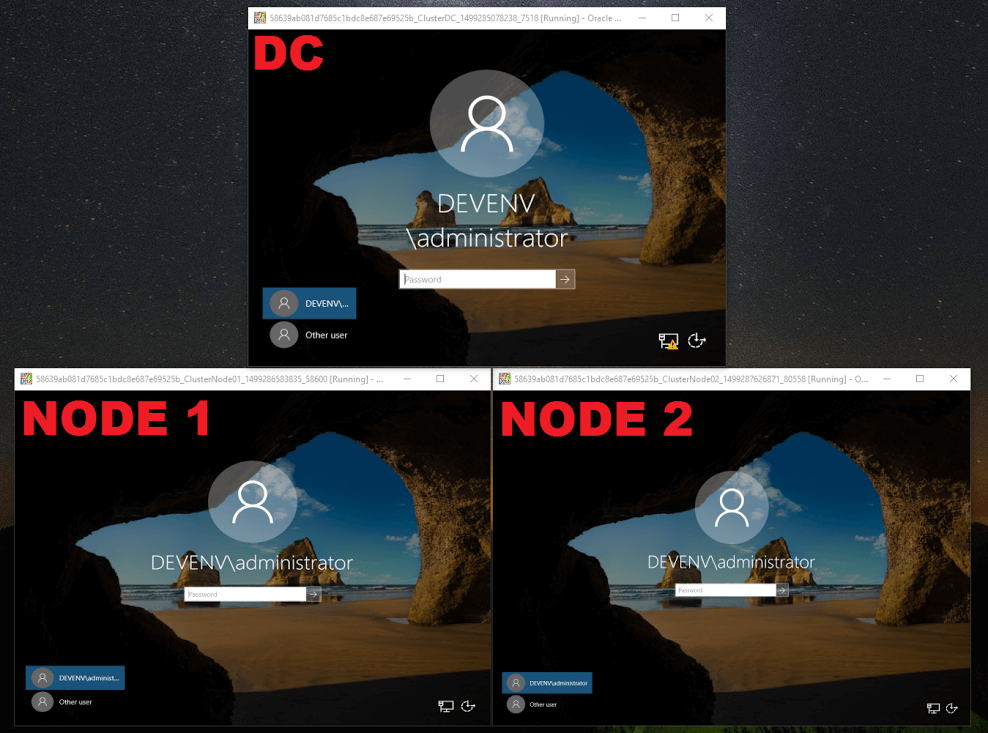

For those that want a Windows cluster environment, but do not want to read through documentation that was clearly not designed for mortals such as myself.

The Vagrantfile below will create a domain controller VM and two cluster node VMs based on the YAML parameters.
Additional nodes can be added, but this should be done before running `vagrant up` for the first time.

Be warned that running this environment on a single disk requires considerable throughput and I do not recommend running on your primary system disk.
Also, security configuration is set for test use only. **NOT FOR PRODUCTION USE!**

### Basic usage:

 * Install Virtualbox
 * Install Vagrant
 * Copy Vagrantfile & user_params.yml to a directory
 * Update the YAML file as needed
 * Run `vagrant up` or `vagrant up ClusterDC ClusterNode01 ClusterNode02`
 * The "Create cluster" provision runs on the last node VM

---

The domain controller houses the file share witness and all VMs are joined to the specified domain.

**user_params.yml**

:dc01:
  :name:         ClusterDC
  :public_ip:    192.168.0.210

:nodes:
  :node1:
    :name:       ClusterNode01
    :public_ip:  192.168.0.211
    :private_ip: 192.168.2.11
  :node2:
    :name:       ClusterNode02
    :public_ip:  192.168.0.212
    :private_ip: 192.168.2.12

:domain:
  :name:         devenv.local
  :netbios_name: DEVENV
  :pass:         D3vp@ss

:cluster:
  :name:         DevCluster
  :ip:           192.168.0.200

:default_router: 192.168.0.1
:timezone:       Eastern Standard Time
:boot_timeout:   2000


**Vagrantfile**

# -*- mode: ruby -*-
# vi: set ft=ruby :
require 'yaml'

Vagrant.require_version ">= 1.9.4"

user_params = YAML.load_file('user_params.yml')
cluster_nodes = user_params[:nodes].map { |key, value| value[:name] }.join(',')
reverse_lookup_ip = user_params[:dc01][:public_ip].sub(/(.*)\b#{user_params[:dc01][:public_ip].split('.')[3]}\b/i, '\10')

required_plugins = %w(vagrant-reload)

plugins_to_install = required_plugins.select { |plugin| not Vagrant.has_plugin? plugin }
if not plugins_to_install.empty?
  puts "Installing plugins: #{plugins_to_install.join(' ')}"
  if system "vagrant plugin install #{plugins_to_install.join(' ')}"
    exec "vagrant #{ARGV.join(' ')}"
  else
    abort "Installation of one or more plugins has failed. Aborting."
  end
end

Vagrant.configure("2") do |config|

  config.vm.define user_params[:dc01][:name] do |dc|
    dc.vm.box = "jacqinthebox/windowsserver2016"
    dc.vm.hostname = user_params[:dc01][:name]
    dc.vm.boot_timeout = user_params[:boot_timeout]
    dc.winrm.transport = :plaintext
    dc.winrm.basic_auth_only = true

    dc.vm.network "public_network", ip: user_params[:dc01][:public_ip], auto_config: false

    dc.vm.provider :virtualbox do |v|
      v.linked_clone = true
    end

    dc.vm.provision "Configure public network", type: "shell",
      inline: "netsh interface ipv4 set address 'Ethernet 2' static #{user_params[:dc01][:public_ip]} 255.255.255.0 #{user_params[:default_router]}",
      privileged: false
    dc.vm.provision "Disable firewall|Extend license|Set time", type: "shell",
      inline: "Set-NetFirewallProfile -Profile Domain,Public,Private -Enabled False; slmgr -rearmpause; Set-TimeZone \"#{user_params[:timezone]}\""
    dc.vm.provision "Install AD", type: "shell",
      inline: "Install-windowsfeature -name AD-Domain-Services -IncludeManagementTools -Source 'C:\\Windows\\WinSxS'",
      privileged: false
    dc.vm.provision "Install domain", type: "shell",
      inline: "Install-ADDSForest -CreateDnsDelegation:$false -DatabasePath 'C:\\Windows\\NTDS' -DomainName '#{user_params[:domain][:name]}' -DomainNetbiosName '#{user_params[:domain][:netbios_name]}' -safemodeadministratorpassword (convertto-securestring '#{user_params[:domain][:pass]}' -asplaintext -force) -InstallDns:$true -LogPath 'C:\\Windows\\NTDS' -NoRebootOnCompletion:$true -SysvolPath 'C:\\Windows\\SYSVOL' -Force:$true"
    dc.vm.provision :reload
    dc.vm.provision "Add reverse lookup zone", type: "shell",
      inline: "Start-Sleep -s 120; Add-DnsServerPrimaryZone -DynamicUpdate Secure -NetworkId '#{reverse_lookup_ip}' -ReplicationScope Domain"
    dc.vm.provision  "Create file share witness", type: "shell",
      inline: "New-Item \"C:\\FileShareWitness\" -type directory; New-SMBShare -Name \"FileShareWitness\" -Path \"C:\\FileShareWitness\" -FullAccess #{user_params[:domain][:name]}\\administrator, #{user_params[:domain][:name]}\\vagrant"
  end

  (1..user_params[:nodes].count).each do |i|
    node_id = eval("user_params[:nodes][:node#{i}]")
    config.vm.define node_id[:name] do |node|
      node.vm.box = "jacqinthebox/windowsserver2016"

      node.vm.hostname = node_id[:name]
      node.vm.boot_timeout = user_params[:boot_timeout]
      node.winrm.timeout = user_params[:boot_timeout]
      node.winrm.transport = :plaintext
      node.winrm.basic_auth_only = true
      node.winrm.retry_delay = 30
      node.winrm.ssl_peer_verification = false

      node.vm.provider :virtualbox do |v|
        v.linked_clone = true
      end

      node.vm.network "public_network", ip: node_id[:public_ip], auto_config: false
      node.vm.network "private_network", ip: node_id[:private_ip]
      node.vm.network "forwarded_port", guest: 1433, host: 1433, protocol: "tcp", auto_correct: true

      node.vm.provision "Configure public network", type: "shell",
        inline: "netsh interface ipv4 set address 'Ethernet 2' static #{node_id[:public_ip]} 255.255.255.0 #{user_params[:default_router]}",
        privileged: false
      node.vm.provision "Set DNS", type: "shell",
        inline: "netsh interface ipv4 set dns 'Ethernet 2' static #{user_params[:dc01][:public_ip]}",
        privileged: false
      node.vm.provision "Install Failover Cluster", type: "shell",
        inline: "Install-WindowsFeature -Name Failover-Clustering -IncludeManagementTools -Source 'C:\\Windows\\WinSxS'",
        privileged: false
      node.vm.provision "Install NET 3_5", type: "shell",
        inline: "Install-WindowsFeature Net-Framework-Core -Source 'C:\\Windows\\WinSxS'",
        privileged: false
      node.vm.provision "Disable firewall|Extend license|Set time", type: "shell",
        inline: "Set-NetFirewallProfile -Profile Domain,Public,Private -Enabled False; slmgr -rearmpause; Set-TimeZone \"#{user_params[:timezone]}\""
      node.vm.provision "Join domain", type: "shell",
        inline: "netdom join #{node_id[:name]} /domain:#{user_params[:domain][:name]}"
      node.vm.provision :reload
      if i.equal?((1..user_params[:nodes].count).last)
        node.vm.provision  "Create cluster", type: "shell",
          inline: "New-Cluster -Name #{user_params[:cluster][:name]} -NoStorage -Node #{cluster_nodes} -StaticAddress #{user_params[:cluster][:ip]} -IgnoreNetwork 10.0.2.0/24; Set-ClusterQuorum -NodeAndFileShareMajority \\\\CLUSTERDC\\FileShareWitness"
      end
    end
  end

end


### MSSQL Server Failover Cluster Tips:

 * Enable "AlwaysOn" for each SQL instance within configuration manager
 * Run SQL Server instances under static port `1433`
 * Run SQL Server instances under a domain user
 * Run listener under static port `192.168.0.209`
 * If primary instance fails, force failover with: `ALTER AVAILABILITY GROUP <AG Name> FORCE_FAILOVER_ALLOW_DATA_LOSS;`
 * After primary (now secondary) instance is online after a forced failover, re-synchronize database with: `ALTER DATABASE <Database Name> SET HADR RESUME;`

---

### Errors:

1. ***The security database on this server does not have a computer account for this workstation***

    May occur when logging into node server if domain controller server is built/rebuilt afterwards

 * Login with local account and remove server from domain: `netdom remove <server_name> /force`

 * Rejoin server to domain: `netdom join <server_name> /domain:<domain_name>`

2. ***Timed out while waiting for the machine to boot.***

    Connection lost to VM.

 * Force close VM and run `vagrant up` or `vagrant up --provision` if the initial setup did not complete

3. ***Install-WindowsFeature : The FeatureType code is out of range***

    Potential corrupt cache registry key

 * Force close VM and run `vagrant up` or `vagrant up --provision` if the initial setup did not complete

4. ***The guest machine entered an invalid state while waiting for it to boot.***

    Known to occur after the "Join domain" provision and restart

 * Run `vagrant up --provision` or if you know the specific missing provision `vagrant up --provision-with "Setup storage"`
 
