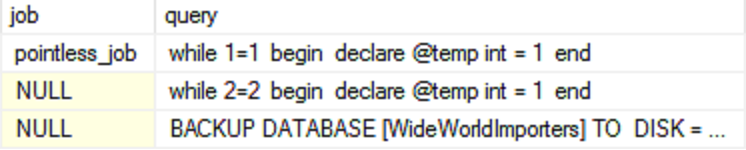
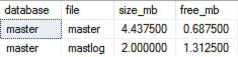
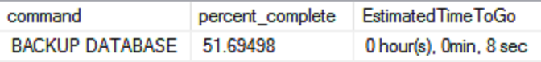

Many of us (or at least I hope) have go-to tools or applications to monitor database activity, but what about when you get the Monday morning call to check out a melting database instance that you never knew existed?
What about when you're only able to login through a DAC?

Sometimes it's best to start out by running T-SQL scripts to see what's going on before you start making changes (adding monitoring applications and/or stored procedures).

### **Running queries and jobs:**


SELECT
  req.session_id AS [session],
  ses.program_name AS [program],
  jobs.name AS [job],
  sqltext.TEXT AS [query],
  DB_NAME(req.database_id) AS [database],
  req.status,
  req.command,
  CONVERT(varchar(10), (req.cpu_time / 86400000)) + ':' +
  CONVERT(varchar(10), ((req.cpu_time % 86400000) / 3600000)) + ':' +
  CONVERT(varchar(10), (((req.cpu_time % 86400000) % 3600000) / 60000)) + ':' +
  CONVERT(varchar(10), ((((req.cpu_time % 86400000) % 3600000) % 60000) / 1000)) + ':' +
  CONVERT(varchar(10), (((req.cpu_time % 86400000) % 3600000) % 1000)) AS [cpu_DD:HH:MM:SS:MS],
  CONVERT(varchar(10), (req.total_elapsed_time / 86400000)) + ':' +
  CONVERT(varchar(10), ((req.total_elapsed_time % 86400000) / 3600000)) + ':' +
  CONVERT(varchar(10), (((req.total_elapsed_time % 86400000) % 3600000) / 60000)) + ':' +
  CONVERT(varchar(10), ((((req.total_elapsed_time % 86400000) % 3600000) % 60000) / 1000)) + ':' +
  CONVERT(varchar(10), (((req.total_elapsed_time % 86400000) % 3600000) % 1000)) AS [elapsed_DD:HH:MM:SS:MS],
  ses.login_name AS [login],
  ses.host_name AS [host]
FROM sys.dm_exec_requests req
LEFT JOIN sys.dm_exec_sessions ses
  ON ses.session_id = req.session_id
LEFT JOIN msdb.dbo.sysjobs jobs
  ON SUBSTRING(ISNULL(ses.[program_name], ''), CHARINDEX('0x', ISNULL(ses.[program_name], '')) + 18, 16)
  = SUBSTRING(REPLACE(ISNULL(jobs.[job_id], ''), '-', ''), 17, 16)
CROSS APPLY sys.dm_exec_sql_text(sql_handle) AS sqltext
WHERE req.session_id != @@spid
ORDER BY [elapsed_DD:HH:MM:SS:MS] DESC
GO


What matters:

{:class="img-border"}

---

### **File space for selected database:**


SELECT 
  DB_NAME() AS [database], 
  name AS [file], 
  size/128.0 AS [size_mb],  
  size/128.0 - CAST(FILEPROPERTY(name, 'SpaceUsed') AS INT)/128.0 AS [free_mb] 
FROM sys.database_files; 
GO


What matters:

{:class="img-border"}

---

### **Running commands (with % complete):**


SELECT
  session_id AS [session],
  DB_NAME(database_id) AS [database],
  command,
  percent_complete,
  CAST((estimated_completion_time / 3600000) AS varchar) + ' hour(s), '
  + CAST((estimated_completion_time % 3600000) / 60000 AS varchar) + 'min, '
  + CAST((estimated_completion_time % 60000) / 1000 AS varchar) + ' sec' AS EstimatedTimeToGo,
  DATEADD(ms, estimated_completion_time, GETDATE()) AS EstimatedEndTime,
  start_time,
  status,
  cpu_time
FROM sys.dm_exec_requests
WHERE percent_complete > 0
ORDER BY session_id DESC
GO


What matters:

{:class="img-border"}

>This includes the following potential heavy hitters:
>
> * ALTER INDEX REORGANIZE
> * AUTO_SHRINK option with ALTER DATABASE
> * BACKUP DATABASE
> * DBCC CHECKDB
> * DBCC CHECKFILEGROUP
> * DBCC CHECKTABLE
> * DBCC INDEXDEFRAG
> * DBCC SHRINKDATABASE
> * DBCC SHRINKFILE
> * RECOVERY
> * RESTORE DATABASE
> * ROLLBACK
> * TDE ENCRYPTION

Click <a href="https://gist.githubusercontent.com/JosiahSiegel/500d25c187f97f1737de/raw/quick_analysis.sql" target="_blank">HERE</a> for the all in one script.

