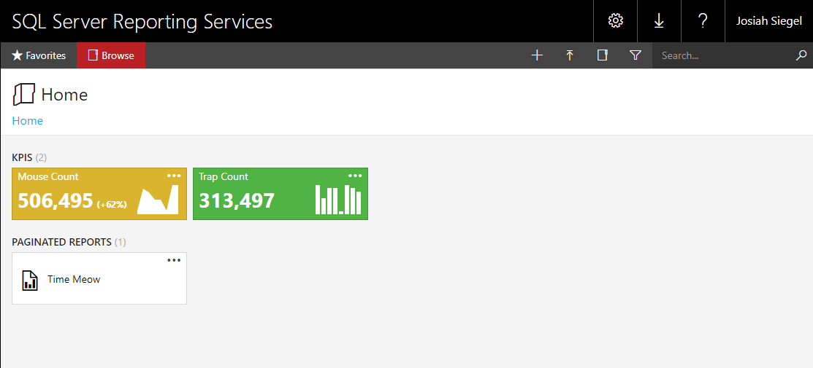
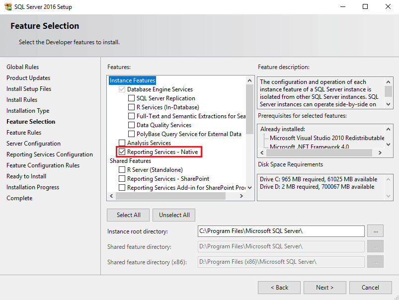
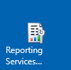
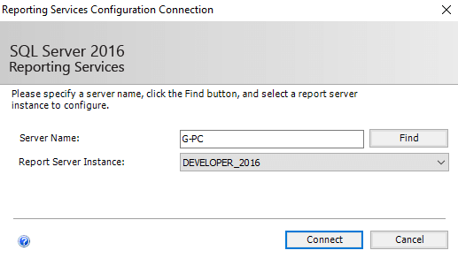

SQL Server Reporting Services (SSRS); as of the 2016 edition, is now worth your attention. Mobile-friendly, HTML 5, LESS CSS, Windows Authentication, paginated reports, KPIs, email subscriptions, and more.

If you’re running anything older than SQL Server 2016, you may want to consider an upgrade. 
One option is SQL Server Express 2016; although, subscriptions, KPIs, and a few other features are not available in this free edition.

SSRS 2016:

{:class="img-border"}

To install SSRS, you&#39;ll need to install it as a feature within SQL Server setup:

{:class="img-border"}

Once installed, look for &quot;Reporting Services Configuration Manager&quot;:

{:class="img-border"}

Connect to the Report Server Instance. This is the same instance you just installed SSRS as a feature:

{:class="img-border"}

You&#39;ll want to step through every menu item on the left side. Some options may be configured correctly by default, but will not go into effect until you click &quot;Apply&quot;.

## Report Services Configuration Manager menu:

- **&lt;Instance Name&gt;:** Ensure Report Service Status = &quot;Started&quot;.
- **Service Account:** Specify the  account to run the report server service.
- **Web Service URL:** Set the report server name and port. Click &quot;Apply&quot;.
  - This is the address you will connect to for publishing reports.
- **Database:** Click &quot;Change Database&quot; and select &quot;Create a new report server database&quot;.
  - The database server fields auto-populate, but the &quot;Server Name&quot; may be incorrect.
- **Web Portal URL:** Set the web portal URL. Click &quot;Apply&quot;.
  - This is the address users will need to view the web portal.

The rest of the menu items are optional, including &quot;E-mail Settings&quot; to enable email subscriptions and &quot;Subscription Settings&quot; to configure a file share account.

Now that your report server is ready (you can successfully navigate to the Web Portal URL), you&#39;ll want to download and install the SQL Server 2016 Report Builder.

If you don&#39;t specify the report server during the Report Builder install, you can still manually specify which report server to connect to on the bottom toolbar.

## Report Builder quick start:

- Click &quot;Blank Report&quot;.
- On the top of the report, add a title.
- Right-click &quot;Data Sources&quot; on the left "Report Data" toolbar and select &quot;Add Data Source&quot;.
- Choose &quot;Use a connection embedded in my report&quot;.
- Click &quot;Build&quot; just to the right of the connection string textarea.
  - For &quot;Server name&quot;, enter your SQL instance that contains data you want to report on.
  - Pick a database and click OK.
- Click OK to create your new data source.
- Right-click &quot;Datasets&quot; on the left toolbar and select &quot;Add Dataset&quot;.
- Choose &quot;Use a dataset embedded in my report&quot;.
- Under the &quot;Data Source&quot; dropdown, select the one you previously created.
- Choose the &quot;Text&quot; query type and add any functional query.
  - `SELECT GETDATE() AS [DATE]` will work if you don&#39;t have one ready.
- Click OK to create your new dataset.
- In the top menu, select &quot;Insert&quot;, then &quot;Table&gt;Table Wizard&quot;.
  - Select your new dataset. Click next.
  - Drag your fields from &quot;Available fields&quot; to &quot;Values&quot;. Click next.
  - For &quot;Choose the layout&quot;, click next, and then Finish.
- If you want to adjust the size of any columns, select the table and drag the grey boxes that appear.
- In the top menu, select &quot;Home&quot;, then &quot;Run&quot;.
- If you aren&#39;t currently connected to your report server, you&#39;ll want to do that first by selecting &quot;Connect&quot; on the bottom toolbar.
- Once your report is complete, in the top menu, select &quot;File&gt;Save As&quot;.
  - Name your report (the user will see this name). Click save.
- Navigate to your Web Portal URL and refresh the page to see your report.
- You can also create folders and specify permissions to collections of reports that reside within.

---

SSRS has come along way.
This is the first time that I feel it can be used as a suitable replacement for custom SQL Server reporting applications; which have a tendancy of consuming many development hours maintaining.

