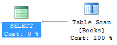
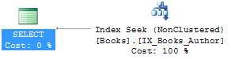
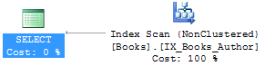

There’s no such thing as a one size fits all solution when it comes to indexing. Because of this, learning how to properly index can be a frustrating endeavor when much of the information out there appears to be contradictory. If the basics are not broken down into digestible chunks, odds are I will consider what I am reading a nice exercise on database theory, instead of something I am ready to apply in a real-world scenario.

To start off, here is a short list of helpful facts:
 
 * A table is either clustered or a heap.
 * Clustered tables contain data that is physically sorted by a single clustered index.
 * A heap does not contain a clustered index and it’s essentially a pile of unsorted data.
 * It’s possible to have one or more non-clustered indexes on a heap or a clustered table.

Here is an example of a heap with some rows inserted:


CREATE TABLE Books (
    Id     INT IDENTITY(1,1) NOT NULL,
    Title  VARCHAR(50) NOT NULL,
    Author VARCHAR(50) NULL
);
INSERT INTO Books (Title, Author)
    VALUES ('The Lord of the Rings','J. R. R. Tolkien');
INSERT INTO Books (Title, Author) 
    VALUES ('Le Morte d''Arthur','Thomas Malory');


Select the values and view the execution plan by enabling the SSMS option “Include Actual Execution Plan” (Ctrl-M):


SELECT Title FROM Books WHERE Author = 'Thomas Malory';


The execution plan will contain a “Table Scan”, as the entire table needs to be read to complete your request.
While you will not notice an impact with just two rows, it is highly inefficient to have full scans when you query the table.
We can remedy this by creating a non-clustered index on the column we are searching ([Author]) and by including columns that we want to return ([Title]).


CREATE NONCLUSTERED INDEX IX_Books_Author
    ON Books (Author) INCLUDE (Title);


Running the same select query will result in an index seek, which is preferred as SQL Server traverses a b-tree to seek directly to matching records. 

If we want to find [Author] based upon [Title], an index scan would be required, as SQL Server must read the entire index to find matching values.
While not ideal, an index scan is faster than a table scan as it should contain fewer columns.


SELECT Author FROM Books WHERE Title = 'Le Morte d''Arthur';


If we want to have the [Id] column in our original result set, a table scan would again be required, as the non-clustered index does not cover that column.
Here is where we see one of the benefits of having a clustered index.
Non-clustered indexes implicitly inherit the columns of a clustered index.
By creating a clustered index on [Id], we can again achieve an index seek.
A clustered index can be added after a table was created using an `ALTER TABLE` statement, or it can be included in the create statement by designating a column as a primary key.


ALTER TABLE Books   
ADD CONSTRAINT PK_Books_Id PRIMARY KEY CLUSTERED (Id);  
GO
SELECT Title, Id FROM Books WHERE Author = 'Thomas Malory';


If the non-clustered index only partially covers the data required by a query, the query optimizer may find it optimal to perform a key lookup against the clustered index to find the remaining data.
This operation is more expensive than having a covering index that can pull all required data via an index seek.

While this is a small sample of what can be achieved with proper indexing, knowing what to look for in your execution plans is vital in determining if your indexes are properly covering your queries or just literally wasting space.

