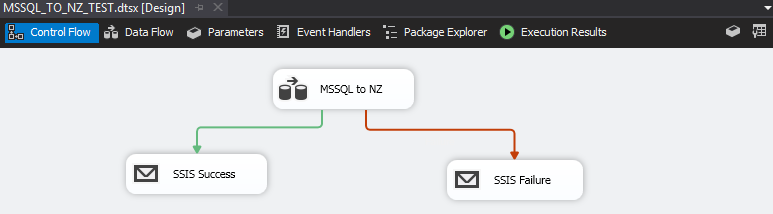
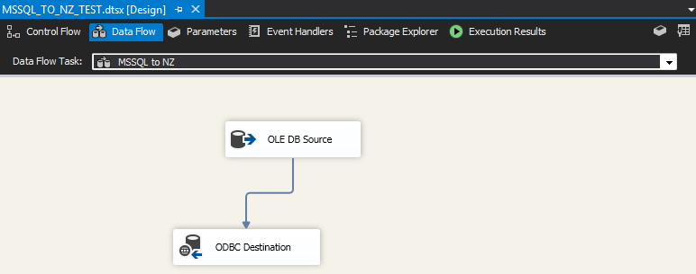
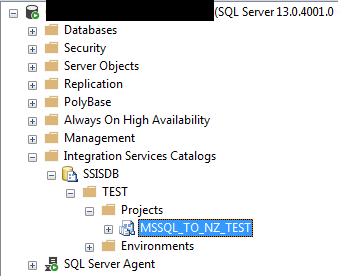
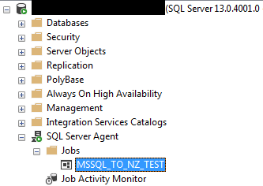

Using SQL Server Integration Services (SSIS), we can easily move data between data sources and schedule the task as a SQL Agent job.
To demonstrate, below are the steps required to upload data from a SQL Server database into a Netezza database (using OLE DB to ODBC).

1. Install Visual Studio and SQL Server Data Tools (SSDT)

2. Create a Visual Studio SSIS project.
   * Set project compatibility to match SQL Server version: 
     * `Properties > Configuration Properties > General > TargetServerVersion`
     * If you are prompted to reload all files, select "Yes to All".

3. In the package designer's "Control Flow" tab, add a [Data Flow Task](https://docs.microsoft.com/en-us/sql/integration-services/control-flow/data-flow-task) from the SSIS Toolbox. I recommend attaching success and failure notifications.

   {:class="img-border"}

4. In the Data Flow Task, add a "Source Assistant" to create the OLE DB connection to SQL Server and add an "ODBC Destination" to Netezza.
   * ODBC connection must exist on all servers that run this SSIS package

   {:class="img-border"}

5. Select `Project > Deploy` to upload the package into an SSIS catalog.

   {:class="img-border"}

6. Create a SQL Agent job to schedule and run the uploaded SSIS package.
   * You will encounter an error at this step if the proper compatibility is not set (step 2).

   {:class="img-border"}

